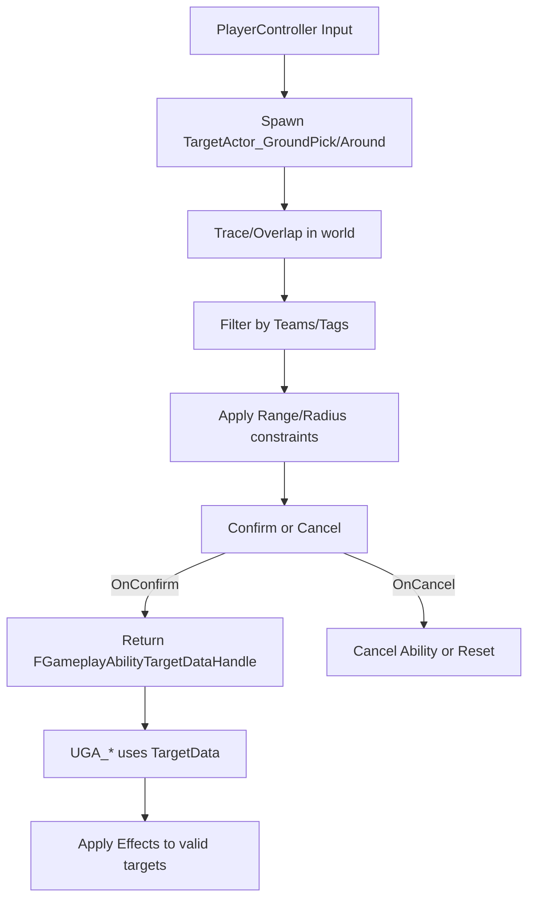
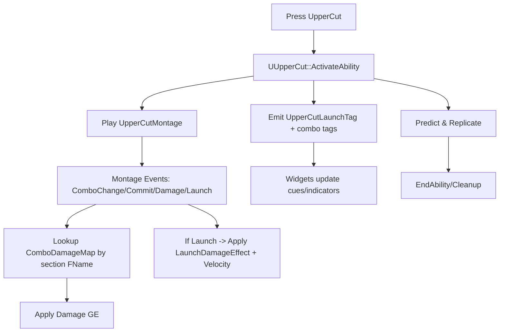

# GAS Subsystem

This folder implements Crunch's Gameplay Ability System (GAS) layer: custom AbilitySystemComponent, base ability/attribute types, concrete gameplay abilities, targeting actors, and gameplay effect calculations.

Contents
- Core
  - CAbilitySystemComponent: Project-specific ASC utilities and bindings.
  - CGameplayAbility / CGameplayAbilityTypes: Base ability and shared enums/structs.
  - CAttributeSet / CHeroAttributeSet: Base and hero-specific attributes (Health, Mana, AD, Armor, MoveSpeed, etc.).
  - CAbilitySystemStatics: Helper statics for tags, cooldowns, costs, lookups.
  - PA_AbilitySystemGenerics: Blueprint/C++ generic helpers and common ability tasks.
- Gameplay Abilities
  - GA_* abilities (Blink, Dash, Shoot, Combo, Blackhole, Lazer, GroundBlast, Tornado, Freeze, Launched, Dead): Active abilities and state abilities.
- Targeting
  - TargetActor_* and TA_*: Custom target acquisition (line, ground pick, around, blackhole, etc.).
- Gameplay Effect Calculations
  - MMC_*: Attribute magnitude calculations (e.g., base attack damage, level-based scaling).
- Projectiles
  - ProjectileActor: Generic projectile implementation used by abilities (e.g., Shoot/Lazer variants).

Key Integrations
- Player/Character
  - ASC is initialized on the player character and mirrored to widgets via attribute delegates.
  - Abilities are granted on possession/initialization; input bindings use `ECAbilityInputID`.
- Widgets/HUD
  - AbilityListView reads abilities and updates gauges for cooldowns and resource costs.
  - Attribute gauges subscribe to AttributeSet change delegates.
- Effects/Tags
  - Gameplay tags mark states (e.g., Dead, Launched, Frozen) and control ability activation.
  - Cooldown and cost tags are standardized via CAbilitySystemStatics.

Typical Flows
- Ability Activation
  1) Input triggers ASC ability by `ECAbilityInputID`.
  2) Ability checks tags, costs, and cooldowns via Statics/helpers.
  3) If targeting is required, a TargetActor_* is spawned and returns target data.
  4) Ability commits cost/cooldown and applies effects/projectiles as needed.
- Attribute Changes
  1) Effects modify attributes via MMCs.
  2) Attribute change delegates fire -> HUD gauges update via bound widgets.
- Death/State Abilities
  1) On fatal damage or state onset, GA_Dead/GA_Launched/GA_Freeze applies tags and animation/logic.

Design Notes
- Keep all gameplay-authoritative logic in abilities/effects; widgets react via delegates only.
- Use ASC prediction for client-side responsiveness; ensure server validation on impact.
- Centralize tag names and cooldown/cost queries in `CAbilitySystemStatics` for consistency.

## Diagrams

### High-level subsystem relationships (GAS at the center)
```mermaid
flowchart TD
  subgraph Core[GAS Subsystem]
    GAS_Abilities[Abilities (UGA_*)]
    GAS_Effects[GameplayEffects (GE_*)]
    GAS_Attrs[AttributeSets (Attributes)]
    GAS_Tags[Gameplay Tags]
    GAS_Targeting[Targeting (TargetActor_*)]
  end

  Character[Character System]
  Player[Player Controller/Input]
  Anim[Animations/Montages]
  AI[AI Subsystem]
  Inventory[Inventory/Items]
  Widgets[UI Widgets]
  Network[Networking/Replication]
  Framework[Framework/Core Game]
  
  Player -->|Input/Bind| GAS_Abilities
  Player -->|Targeting request| GAS_Targeting
  Character -->|ASC Owner| Core
  Anim -->|Montage events -> Tags| GAS_Abilities
  AI -->|Apply/React to Tags/Effects| Core
  Inventory -->|Item/Ability grants| GAS_Abilities
  Widgets -->|Activate ability, show cues| GAS_Abilities
  Widgets -->|Listen to tags/attributes| GAS_Tags
  Network -->|Pred/Rep| Core
  Framework -->|Init/Config| Core

  GAS_Abilities -->|Apply| GAS_Effects
  GAS_Effects -->|Modify| GAS_Attrs
  GAS_Targeting -->|TargetData| GAS_Abilities
  GAS_Tags -->|Gate, State, Cues| GAS_Abilities
```

### Ability activation lifecycle across subsystems
```mermaid
flowchart LR
  Input[Player Input/Command] --> Ability[UGA_* ActivateAbility]
  Ability --> CheckTags[Check/Block by Gameplay Tags]
  Ability --> Montage[Play Animation Montage]
  Montage --> Events[Anim Notifies -> Gameplay Events/Tags]
  Ability --> Targeting[Spawn TargetActor_* (GroundPick/Around)]
  Targeting --> TargetData[Return TargetDataHandle]
  Ability --> Commit[Commit: Cost/Cooldown]
  Ability --> ApplyGE[Apply Gameplay Effects]
  ApplyGE --> Attrs[Modify AttributeSets]
  Ability --> Cues[Emit Gameplay Cues/Tags]
  Cues --> Widgets[UI reacts (HUD/Widgets)]
  Ability --> Rep[Predict/Replicate to Server]
  Rep --> NetState[Server Authority Applies/Confirms]
  NetState --> End[EndAbility / Cleanup]
```

### Targeting and team-filtering flow


### Damage/effects application with calculations
```mermaid
flowchart LR
  Ability[UGA_*] --> SelectGE[Select GE class (by combo/map/default)]
  SelectGE --> ApplyGE[Apply GameplayEffect Spec]
  ApplyGE --> Mods[Modifiers (Add/Mul/Override)]
  Mods --> Attrs[Target AttributeSets]
  ApplyGE --> Calcs[MMC_* (e.g., LevelBased, BaseAttackDamage)]
  Calcs --> FinalDelta[Final Computed Attribute Change]
  FinalDelta --> Attrs
  Attrs --> Tags[Trigger/Remove Gameplay Tags]
  Tags --> Gating[Gate abilities/inputs/AI behavior]
```

### UI Widgets and GAS data/cues
```mermaid
flowchart TD
  GAS_Tags[Gameplay Tags/Cues] --> UI_Update[Widgets Observe (Bind/Events)]
  Attrs[AttributeSets (Health/Mana/etc.)] --> UI_Bind[Widgets Bind/Listen]
  UI_Bind --> Widgets[HUD/Ability/Inventory Widgets]
  Widgets --> PlayerCtrl[Send input/activate requests]
  PlayerCtrl --> Abilities[TryActivateAbility (UGA_*)]
  Abilities --> GAS_Tags
  Abilities --> Attrs
```

### Networking and prediction responsibilities
```mermaid
flowchart LR
  ClientInput[Client Input] --> Pred[Local Prediction Start]
  Pred --> ClientState[Local Cues/Anim/Tags]
  Pred --> ServerRPC[Server RPC ActivateAbility]
  ServerRPC --> ServerAuth[Server Authority Validates/Commits]
  ServerAuth --> ApplyGE[Apply Effects Officially]
  ServerAuth --> Replicate[Replicate ASC/GE/Tags]
  Replicate --> Clients[All Clients Receive State]
  Clients --> Reconcile[Reconcile Predictions (Confirm/Correct)]
```

### Concrete example: UpperCut ability interactions


### Targeted ability example: GA_Blink and GA_Freeze
```mermaid
flowchart LR
  Start[Activate Ability] --> TA[Spawn TargetActor_GroundPick]
  TA --> Select[Player selects ground point (within BlinkCastRange/TargetRange)]
  Select --> Confirm[Confirm -> TargetDataHandle]
  Confirm --> Montage[Play Teleport/Freeze Cast Montage]
  Montage --> Apply[Apply GE(s) at location (AoE radius)]
  Apply --> Push/CC[Push/Freeze effects; cues fired]
  Push/CC --> Finish[EndAbility]
```

### Dash ability and nearby target interaction
```mermaid
flowchart TD
  DashInput[Dash Input] --> UGA_Dash[UGA_Dash Activate]
  UGA_Dash --> DashGE[Apply DashEffect (+movement buff/etc.)]
  UGA_Dash --> TA_Around[Spawn TargetActor_Around (detection radius)]
  TA_Around --> FoundTargets[Return nearby valid targets]
  FoundTargets --> Impact[Push/Damage targets (TargetHitPushSpeed + DamageEffect)]
  UGA_Dash --> Cue[Local Gameplay Cue for VFX/SFX]
  Impact --> EndDash[Clear timers/effects -> EndAbility]
```

To Do
- [ ] Add per-file documentation for all headers (file/class/method/property comments).
- [ ] Provide event/delegate maps for core classes (ASC, abilities, attribute sets).
- [ ] Document gameplay tags by category and their usage across abilities.
